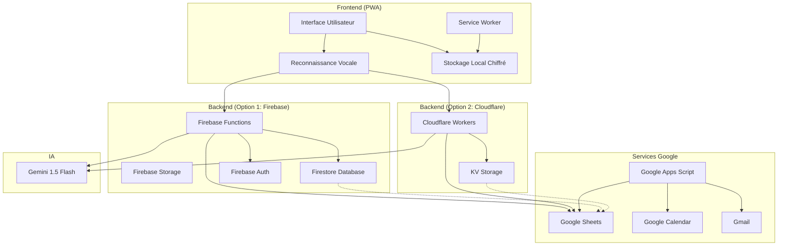
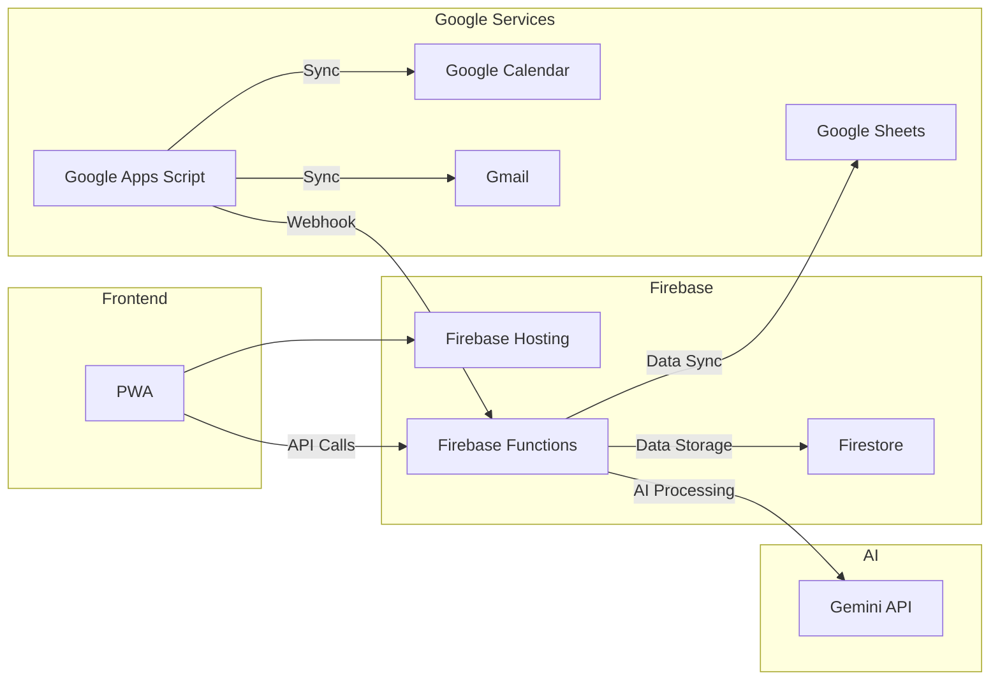
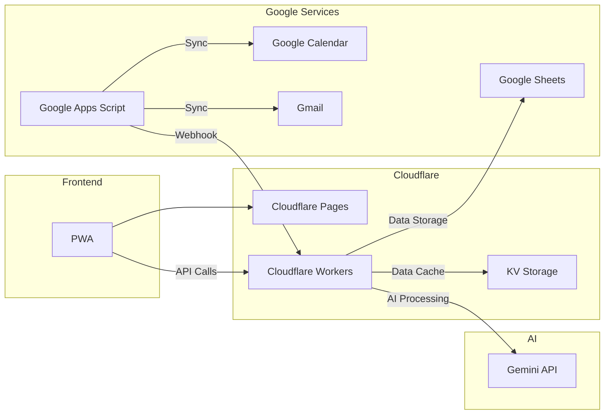
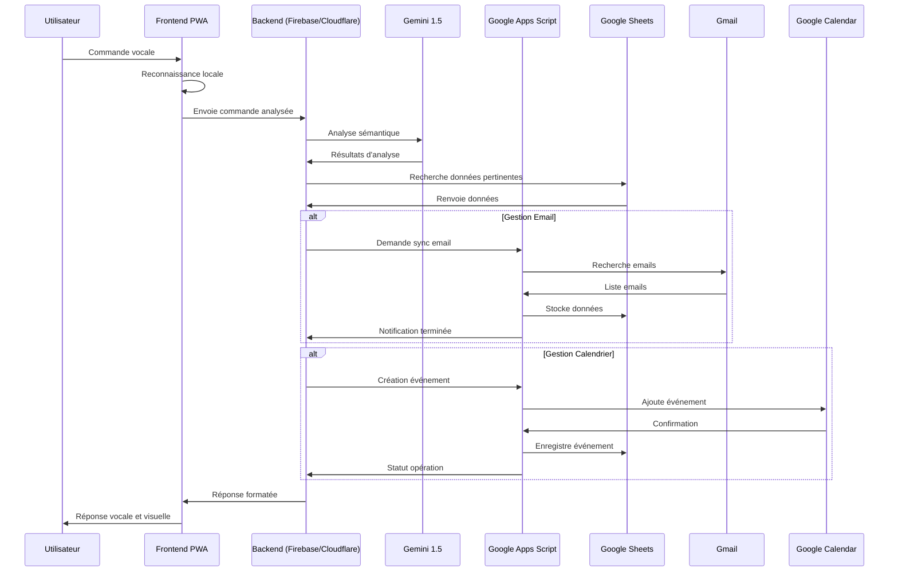
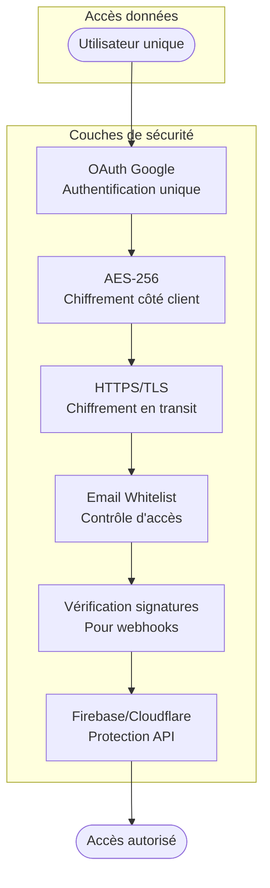
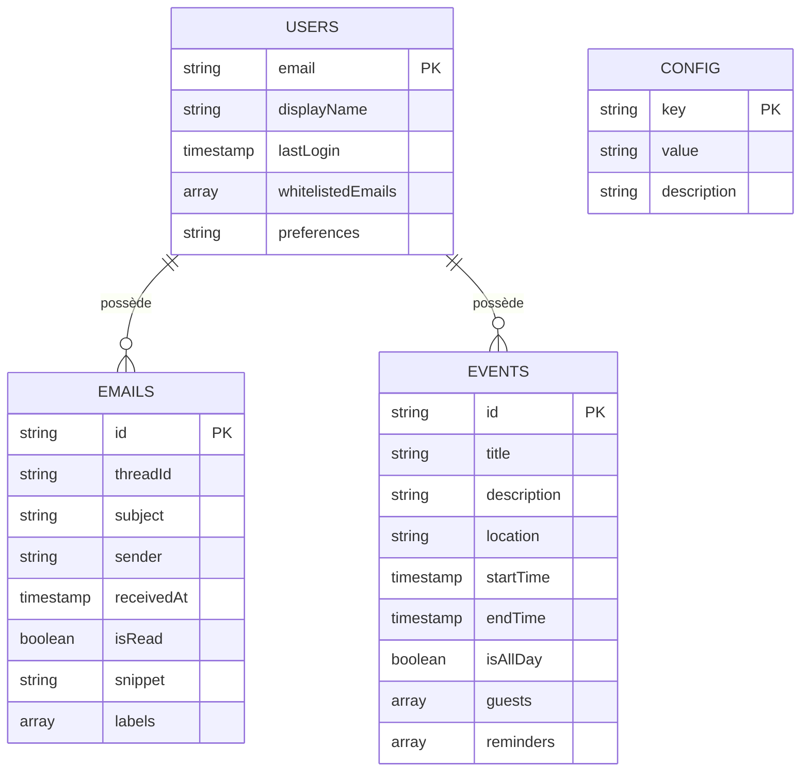
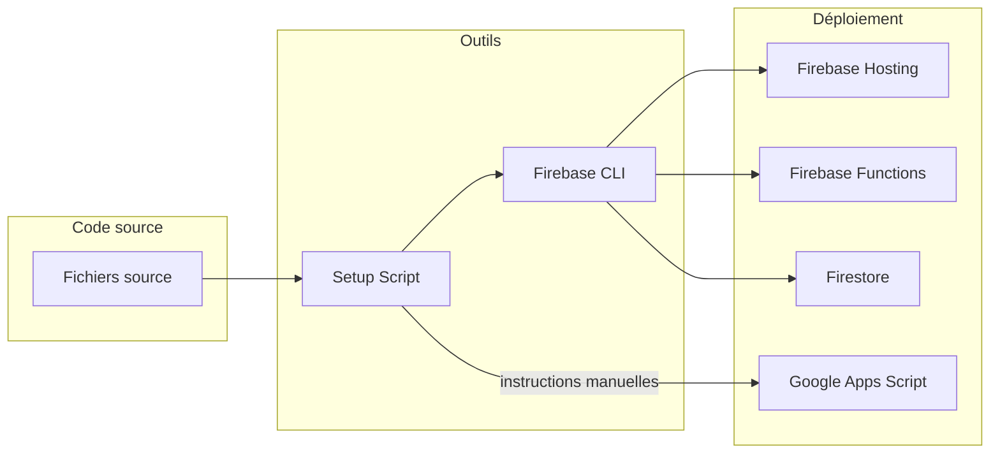
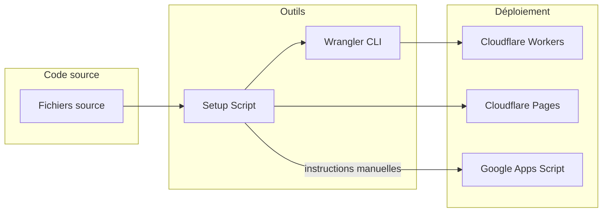

# Architecture de l'Assistant Personnel ZeroConfig

## Vue d'ensemble

## Options de déploiement

### Option 1: Firebase (Recommandée pour débutants)

### Option 2: Cloudflare Workers

## Flux de données

## Architecture de sécurité

## Composants du système

### Frontend
- **Interface PWA** : Preact + Web Components
- **Reconnaissance vocale** : Web Speech API
- **Stockage local** : IndexedDB via localForage
- **Chiffrement** : AES-256 via CryptoJS
- **Service Worker** : Cache et fonctionnement hors-ligne

### Backend (Option 1: Firebase)
- **Serverless** : Firebase Functions
- **Base de données** : Firestore
- **Stockage** : Firebase Storage
- **Authentification** : Firebase Auth via Google
- **Hébergement** : Firebase Hosting (domaine gratuit *.web.app)

### Backend (Option 2: Cloudflare)
- **Serverless** : Cloudflare Workers
- **Cache** : KV Store Cloudflare
- **Authentification** : OAuth via Google (magic links)
- **Hébergement** : Cloudflare Pages ou domaine personnalisé

### Services Google
- **Stockage principal** : Google Sheets comme base de données
- **Emails** : Gmail API
- **Calendrier** : Google Calendar API
- **Synchronisation** : Google Apps Script
- **Authentification** : Google Identity Services

### IA
- **Traitement du langage** : Gemini 1.5 Flash
- **Fallback** : Système de règles locales en cas d'indisponibilité

### Intégrations
- **Webhook** : Communication bidirectionnelle
- **Cron triggers** : Tâches planifiées (Firebase ou Cloudflare)
- **Push notifications** : Service Worker

## Modèle de données

## Déploiement

### Option 1: Firebase

### Option 2: Cloudflare

## Comparaison des options de déploiement

| Fonctionnalité | Firebase | Cloudflare Workers |
|----------------|----------|-------------------|
| **Domaine gratuit** | ✅ (*.web.app) | ✅ (*.workers.dev) |
| **Base de données** | ✅ Firestore | ❌ (utilise Google Sheets) |
| **Stockage fichiers** | ✅ Firebase Storage | ❌ (non inclus) |
| **Limites gratuites** | 125K/mois invocations | 100K/jour requêtes |
| **Facilité d'installation** | ⭐⭐⭐⭐⭐ | ⭐⭐⭐ |
| **Performance** | ⭐⭐⭐⭐ | ⭐⭐⭐⭐⭐ |
| **Support Windows** | ✅ Excellent | ✅ Bon |
| **Interface admin** | ✅ Console Firebase | ❌ Limitée |

## Sécurité et confidentialité

- **Authentification** : Basée sur Google OAuth avec vérification d'email unique
- **Chiffrement** : AES-256 pour toutes les données sensibles stockées localement
- **Isolation** : Accès limité à un seul utilisateur via whitelist d'email
- **Audit** : Vérification quotidienne des permissions et accès
- **Données** : Stockées principalement dans les services Google de l'utilisateur

Cette documentation visuelle illustre l'architecture complète du système "ZeroConfig Personal Assistant", avec les deux options de déploiement (Firebase et Cloudflare Workers), des composants jusqu'au flux de données et au modèle de sécurité.