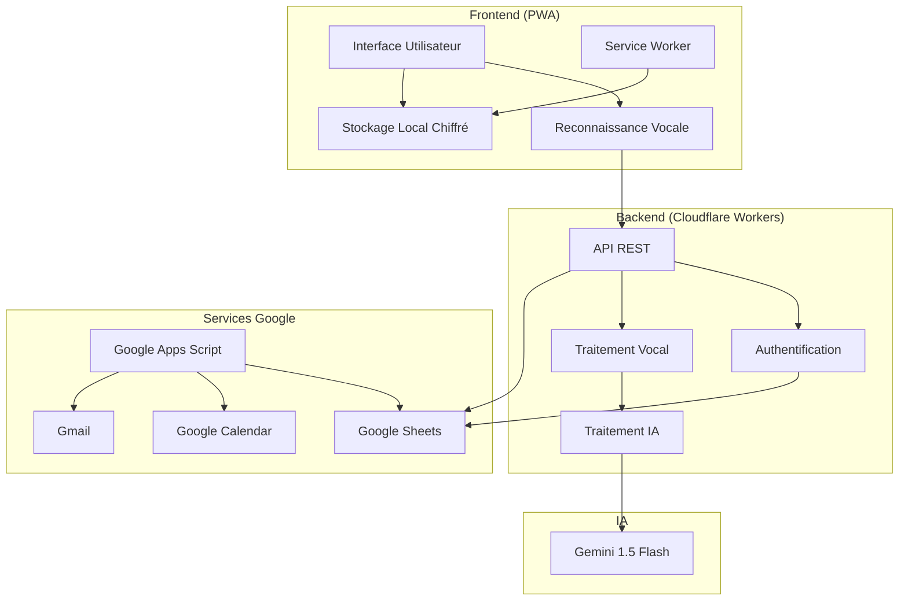
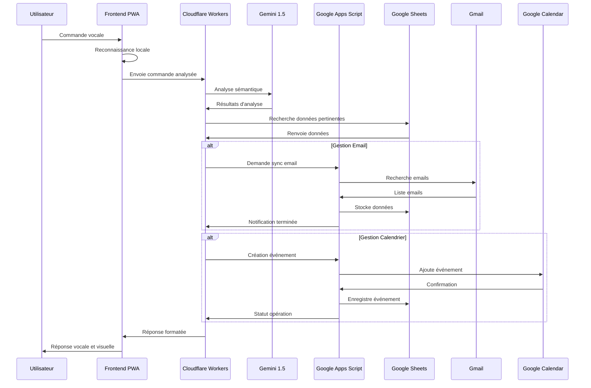
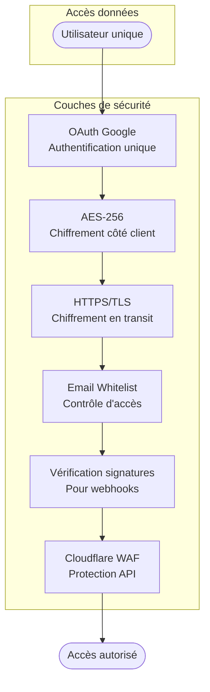
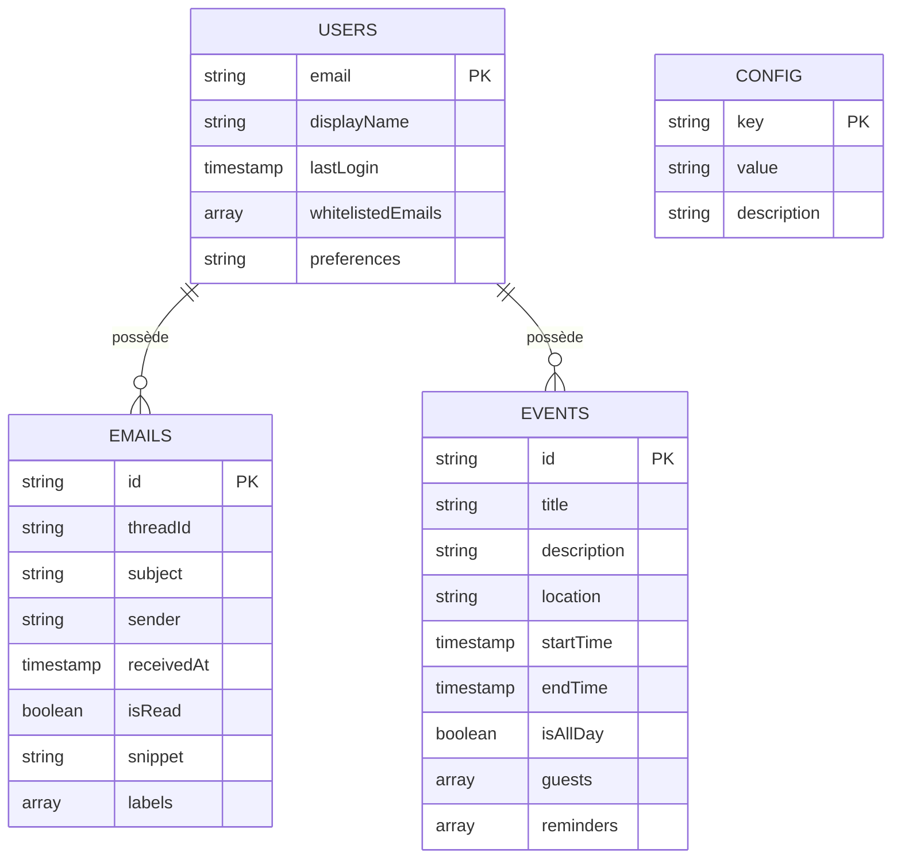
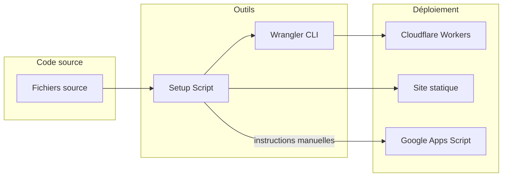

# Architecture de l'Assistant Personnel ZeroConfig

## Vue d'ensemble

## Flux de données

## Architecture de sécurité

## Composants du système

### Frontend
- **Interface PWA** : Preact + Web Components
- **Reconnaissance vocale** : Web Speech API
- **Stockage local** : IndexedDB via localForage
- **Chiffrement** : AES-256 via CryptoJS
- **Service Worker** : Cache et fonctionnement hors-ligne

### Backend
- **Serverless** : Cloudflare Workers
- **API Gateway** : REST avec CORS
- **Authentification** : OAuth via Google (magic links)
- **Traitement IA** : Gemini 1.5 Flash
- **Caching** : KV Store Cloudflare

### Services Google
- **Stockage** : Google Sheets comme base de données
- **Emails** : Gmail API
- **Calendrier** : Google Calendar API
- **Synchronisation** : Google Apps Script
- **Authentification** : Google Identity Services

### Intégrations
- **Webhook** : Communication bidirectionnelle
- **Cron triggers** : Tâches planifiées sur Cloudflare
- **Push notifications** : Service Worker

## Modèle de données

## Déploiement

Cette documentation visuelle illustre l'architecture complète du système "ZeroConfig Personal Assistant", des composants jusqu'au flux de données et au modèle de sécurité.