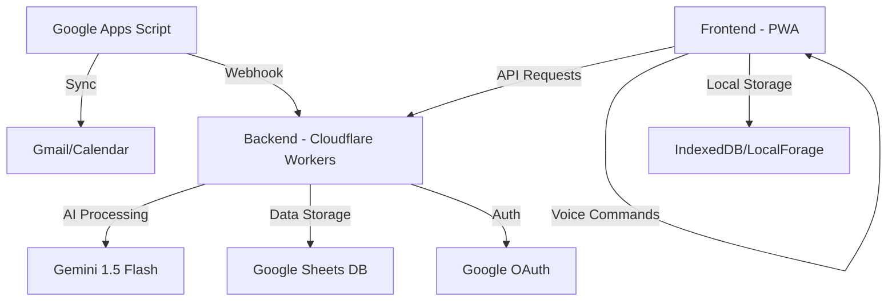

# ZeroConfig Personal Assistant

Un assistant personnel sécurisé, sans configuration complexe, utilisant des services gratuits.

## Architecture

## Fonctionnalités

- 🔐 Authentification sans mot de passe (Magic Links Google-only)
- 🔄 Synchronisation automatique Gmail/Calendar
- 🗣️ Interface vocale intuitive pour les commandes naturelles
- 📅 Création intelligente d'événements avec reconnaissance de patterns
- 🛡️ Sécurité "paranoïaque" avec chiffrement AES-256 côté client

## Déploiement

1. Cloner le repo
2. Exécuter `./setup.sh`
3. Configurer les accès Google via l'interface web
4. Déployer avec `wrangler deploy`
5. Vérifier l'installation avec la checklist fournie

## Sécurité

- Chiffrement des données au repos et en transit
- Whitelist d'emails pour les invitations
- Audit quotidien automatique des permissions
- Accès limité à un seul utilisateur
- Rotation automatique des clés d'API

## Gestion des erreurs

- Mode hors-ligne avec synchronisation différée
- Fallback en cas d'indisponibilité de Gemini
- Export d'urgence au format CSV
- Notifications de dépassement de quota
- Mécanisme de réessai intelligent