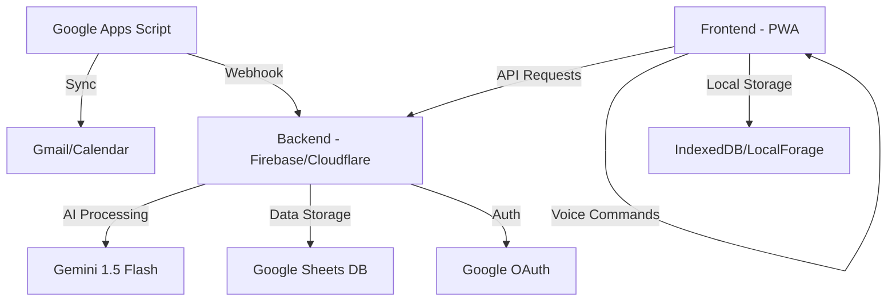

# ZeroConfig Personal Assistant

Un assistant personnel sécurisé, sans configuration complexe, utilisant des services gratuits.

## Présentation

ZeroConfig Personal Assistant est un système d'assistant personnel intelligent qui combine la puissance de l'IA (Gemini 1.5 Flash) avec vos services Google (Gmail, Calendar) pour vous offrir un assistant vocal intuitif et sécurisé. Conçu pour un usage personnel exclusif, il ne nécessite aucune configuration complexe et utilise uniquement des services gratuits.

## Fonctionnalités principales

- 🔐 **Authentification sans mot de passe** via Google OAuth (magic links)
- 🔄 **Synchronisation automatique** avec Gmail et Google Calendar
- 🗣️ **Interface vocale intuitive** pour les commandes naturelles
- 📅 **Création intelligente d'événements** avec reconnaissance de patterns
- 🛡️ **Sécurité "paranoïaque"** avec chiffrement AES-256 côté client
- 📱 **Progressive Web App (PWA)** installable sur tous vos appareils
- 🌐 **Mode hors-ligne** avec synchronisation différée

## Architecture



## Stack technique

### Frontend
- **PWA** basée sur Preact et Web Components
- **Web Speech API** pour la reconnaissance vocale
- **LocalForage** pour le stockage local
- **CryptoJS** pour le chiffrement côté client

### Backend (2 options)
- **Option 1: Firebase**
  - Firebase Functions (serverless)
  - Firestore Database
  - Firebase Hosting (domaine gratuit)
  - Firebase Storage

- **Option 2: Cloudflare Workers**
  - Cloudflare Workers (serverless)
  - KV Storage
  - Sous-domaine workers.dev gratuit

### Stockage et intégrations
- **Google Sheets** comme base de données principale
- **Google Apps Script** pour la synchronisation
- **Gmail API** pour la gestion des emails
- **Google Calendar API** pour les événements

### Intelligence artificielle
- **Gemini 1.5 Flash** pour l'analyse des commandes
- **Système de fallback** en cas d'indisponibilité

## Exemples de commandes vocales

- "Résume mes emails non lus de Jean"
- "Bloque 2h demain pour le projet Zephyr avec rappel SMS"
- "Déjeuner avec Marc et Sophie (marc@mail.com, sophie@proton.me) vendredi midi"

## Installation rapide

### Prérequis
- Un compte Google (Gmail/Google Workspace)
- Node.js et npm installés
- Un compte Firebase (gratuit) OU un compte Cloudflare (gratuit)

### Installation sur Windows
```bash
# Cloner le repo
git clone https://github.com/votre-nom/personal-assistant-zeroconfig.git
cd personal-assistant-zeroconfig

# Lancer le script d'installation (option 1)
setup.bat

# OU avec PowerShell (option 2)
powershell -ExecutionPolicy Bypass -File setup.ps1
```

### Installation sur Linux/Mac
```bash
# Cloner le repo
git clone https://github.com/votre-nom/personal-assistant-zeroconfig.git
cd personal-assistant-zeroconfig

# Rendre le script exécutable et le lancer
chmod +x setup.sh
./setup.sh
```

## Documentation détaillée

- [Tutoriel d'installation et d'utilisation](TUTORIAL.md)
- [Architecture technique détaillée](ARCHITECTURE.md)

## Sécurité

ZeroConfig Personal Assistant est conçu avec une approche "sécurité paranoïaque" :

- **Chiffrement AES-256** de toutes les données sensibles côté client
- **Authentification unique** via Google OAuth
- **Whitelist d'emails** pour les invitations
- **Audit automatique quotidien** des permissions
- **Accès limité** à un seul utilisateur

## Avantages clés

- **100% Free Tier** - Utilise uniquement les niveaux gratuits de tous les services
- **Zéro Configuration** - Pas de fichiers .env ou de configuration complexe
- **Multi-plateforme** - Fonctionne sur tous les appareils modernes
- **Déploiement flexible** - Choix entre Firebase et Cloudflare Workers
- **Domaine gratuit inclus** - Via Firebase Hosting ou Cloudflare Workers

## Limitations

- Conçu pour un usage personnel exclusif (un seul utilisateur)
- Nécessite un compte Google
- Limité aux quotas des plans gratuits des services utilisés

## Contribution

Ce projet est conçu pour un usage personnel, mais les contributions sont les bienvenues. Pour contribuer :

1. Forkez le repo
2. Créez une branche pour votre fonctionnalité (`git checkout -b feature/amazing-feature`)
3. Committez vos changements (`git commit -m 'Add some amazing feature'`)
4. Poussez vers la branche (`git push origin feature/amazing-feature`)
5. Ouvrez une Pull Request

## Licence

Distribué sous la licence MIT. Voir `LICENSE` pour plus d'informations.

## Remerciements

- [Google Gemini API](https://ai.google.dev/) pour les capacités d'IA
- [Firebase](https://firebase.google.com/) et [Cloudflare Workers](https://workers.cloudflare.com/) pour l'hébergement serverless
- [Web Speech API](https://developer.mozilla.org/en-US/docs/Web/API/Web_Speech_API) pour la reconnaissance vocale
- [Preact](https://preactjs.com/) pour le framework frontend léger
- [LocalForage](https://localforage.github.io/localForage/) pour le stockage local